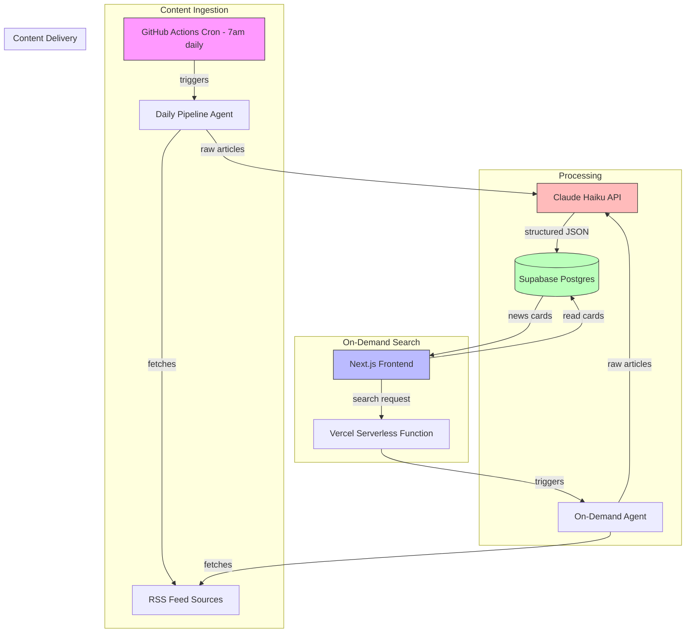
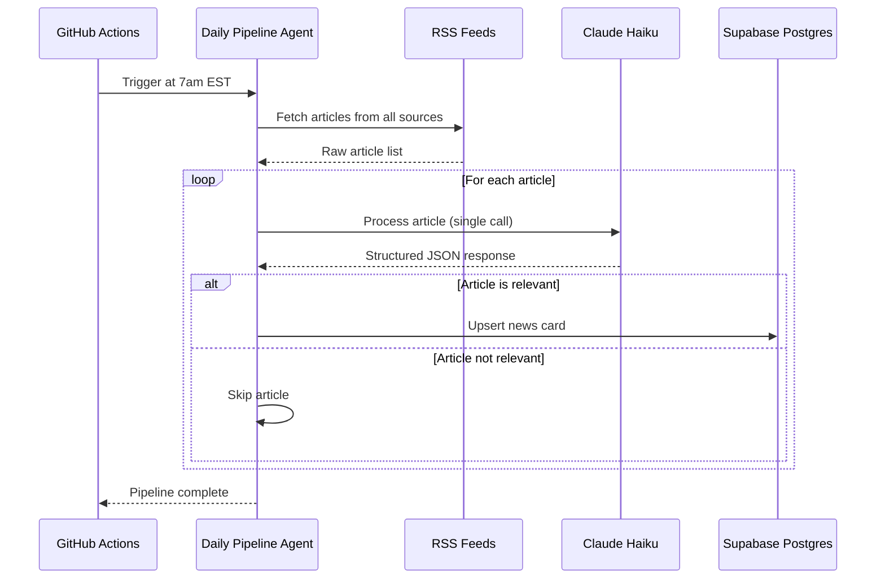
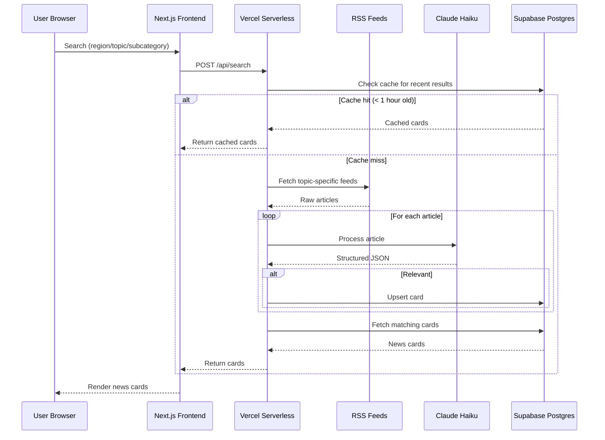

# Design Document: India-US News App

## Overview

A web application that curates and presents news relevant to Indians living in the US. The system operates two content pipelines: a daily scheduled digest (via GitHub Actions cron) that pulls general US-India news every morning, and an on-demand search agent (via Vercel serverless) that lets users search by region, topic, or subcategory. Each news article is processed through a single Claude Haiku LLM call that determines relevance and generates structured card data including an ELI5 explanation.

The architecture prioritizes free-tier hosting across all services (Vercel, Supabase, GitHub Actions) with Claude API calls as the only expected cost. News cards share a uniform format regardless of pipeline origin, and the "dumb it down" feature is a client-side UI toggle revealing pre-generated fields rather than triggering additional LLM calls.

## Architecture



## Sequence Diagrams

### Daily Digest Pipeline



### On-Demand Search



## Components and Interfaces

### Component 1: RSS Feed Fetcher

**Purpose**: Fetches and parses RSS feeds from configured news sources, returning normalized article objects.

```typescript
interface RSSSource {
  id: string;
  name: string;
  url: string;
  category: "india" | "us" | "us-india" | "tech" | "finance";
}

interface RawArticle {
  sourceId: string;
  title: string;
  description: string;
  link: string;
  pubDate: Date;
  content?: string;
}

interface FeedFetcher {
  fetchAll(): Promise<RawArticle[]>;
  fetchByCategory(category: string): Promise<RawArticle[]>;
  fetchByQuery(query: string): Promise<RawArticle[]>;
}
```

**Responsibilities**:
- Maintain list of configured RSS feed URLs
- Parse RSS/Atom XML into normalized article objects
- Handle feed fetch failures gracefully (skip unavailable feeds)
- Deduplicate articles by URL

### Component 2: LLM Article Processor

**Purpose**: Processes a single raw article through Claude Haiku, producing a structured news card with relevance scoring and ELI5 content.

```typescript
interface ProcessedArticle {
  relevant: boolean;
  headline: string;
  summary: string;
  origin: string;
  eli5: {
    background: string;    // where/when the issue started
    explanation: string;   // simple explanation with examples
    consequences: string;  // what it means going forward
  };
  category: RelevanceCategory;
  confidence: number;      // 0-1 relevance confidence
}

type RelevanceCategory =
  | "h1b-immigration"
  | "us-india-trade-diplomacy"
  | "rbi-fed-remittances"
  | "tech-layoffs"
  | "indian-origin-figures"
  | "major-india-news";

interface ArticleProcessor {
  process(article: RawArticle): Promise<ProcessedArticle>;
  processBatch(articles: RawArticle[]): Promise<ProcessedArticle[]>;
}
```

**Responsibilities**:
- Construct prompt with article content and relevance criteria
- Make single Claude Haiku API call per article
- Parse and validate JSON response
- Handle API errors with retry logic (max 2 retries)

### Component 3: News Card Store (Supabase)

**Purpose**: Persists processed news cards and provides query capabilities for the frontend.

```typescript
interface NewsCard {
  id: string;
  sourceUrl: string;
  headline: string;
  summary: string;
  origin: string;
  eli5Background: string;
  eli5Explanation: string;
  eli5Consequences: string;
  category: RelevanceCategory;
  pipeline: "daily" | "on-demand";
  searchQuery?: string;
  publishedAt: Date;
  processedAt: Date;
  expiresAt: Date;
}

interface CardStore {
  upsert(card: Omit<NewsCard, "id">): Promise<NewsCard>;
  upsertBatch(cards: Omit<NewsCard, "id">[]): Promise<NewsCard[]>;
  getLatestCards(limit: number, offset: number): Promise<NewsCard[]>;
  getCardsByCategory(category: RelevanceCategory, limit: number): Promise<NewsCard[]>;
  searchCards(query: string, limit: number): Promise<NewsCard[]>;
  deleteExpired(): Promise<number>;
}
```

**Responsibilities**:
- Store and retrieve news cards with pagination
- Deduplicate by source URL (upsert behavior)
- Auto-expire old cards (7 days for daily, 24 hours for on-demand)
- Support full-text search on headline and summary

### Component 4: Daily Pipeline Agent

**Purpose**: Orchestrates the daily digest flow triggered by GitHub Actions.

```typescript
interface PipelineResult {
  totalFetched: number;
  totalRelevant: number;
  totalStored: number;
  errors: string[];
  durationMs: number;
}

interface DailyPipelineAgent {
  run(): Promise<PipelineResult>;
}
```

**Responsibilities**:
- Fetch all RSS feeds
- Deduplicate against existing cards in DB
- Process new articles through LLM
- Store relevant cards
- Report pipeline metrics

### Component 5: On-Demand Search Agent

**Purpose**: Handles user search requests via Vercel serverless function.

```typescript
interface SearchRequest {
  query: string;
  region?: "us" | "india" | "both";
  category?: RelevanceCategory;
  limit?: number;
}

interface SearchResponse {
  cards: NewsCard[];
  cached: boolean;
  totalResults: number;
}

interface OnDemandAgent {
  search(request: SearchRequest): Promise<SearchResponse>;
}
```

**Responsibilities**:
- Check cache for recent matching results
- Construct topic-specific RSS feed queries
- Process results through LLM
- Store and return relevant cards

### Component 6: Next.js Frontend

**Purpose**: Renders news cards with search, category filtering, and "dumb it down" toggle.

```typescript
interface CardProps {
  card: NewsCard;
  expanded: boolean;
  onToggleEli5: () => void;
}

interface SearchBarProps {
  onSearch: (request: SearchRequest) => void;
  loading: boolean;
}

interface FeedViewProps {
  cards: NewsCard[];
  loading: boolean;
  onLoadMore: () => void;
  hasMore: boolean;
}
```

**Responsibilities**:
- Display news cards in responsive grid
- Toggle ELI5 section visibility (client-side only)
- Provide search interface with region/category filters
- Handle pagination and infinite scroll
- Show loading states during on-demand searches

## Data Models

### Database Schema

```typescript
// Supabase table: news_cards
interface NewsCardRow {
  id: string;                    // UUID, primary key
  source_url: string;            // UNIQUE constraint
  headline: string;              // TEXT NOT NULL
  summary: string;               // TEXT NOT NULL
  origin: string;                // TEXT NOT NULL (source name)
  eli5_background: string;       // TEXT NOT NULL
  eli5_explanation: string;      // TEXT NOT NULL
  eli5_consequences: string;     // TEXT NOT NULL
  category: string;              // TEXT NOT NULL, enum values
  pipeline: string;              // TEXT NOT NULL, 'daily' | 'on-demand'
  search_query: string | null;   // TEXT, nullable
  published_at: string;          // TIMESTAMPTZ
  processed_at: string;          // TIMESTAMPTZ, default now()
  expires_at: string;            // TIMESTAMPTZ
}

// Supabase table: pipeline_runs
interface PipelineRunRow {
  id: string;                    // UUID, primary key
  pipeline: string;              // 'daily' | 'on-demand'
  started_at: string;            // TIMESTAMPTZ
  completed_at: string | null;   // TIMESTAMPTZ
  total_fetched: number;
  total_relevant: number;
  total_stored: number;
  errors: string[];              // JSONB
  status: string;                // 'running' | 'completed' | 'failed'
}
```

**Indexes**:
- `idx_cards_category` on `category`
- `idx_cards_published_at` on `published_at DESC`
- `idx_cards_expires_at` on `expires_at`
- `idx_cards_pipeline` on `pipeline`
- Full-text search index on `headline` and `summary`

**Validation Rules**:
- `source_url` must be a valid URL and unique
- `category` must be one of the defined RelevanceCategory values
- `pipeline` must be either "daily" or "on-demand"
- `published_at` must not be in the future
- `expires_at` must be after `processed_at`

## Algorithmic Pseudocode

### Daily Pipeline Algorithm

```typescript
async function runDailyPipeline(): Promise<PipelineResult> {
  const startTime = Date.now();
  const errors: string[] = [];
  
  // Step 1: Fetch all RSS feeds
  const rawArticles = await feedFetcher.fetchAll();
  
  // Step 2: Deduplicate against existing cards
  const existingUrls = await cardStore.getExistingUrls(
    rawArticles.map(a => a.link)
  );
  const newArticles = rawArticles.filter(a => !existingUrls.has(a.link));
  
  // Step 3: Process each article through LLM
  const relevantCards: Omit<NewsCard, "id">[] = [];
  
  for (const article of newArticles) {
    try {
      const result = await articleProcessor.process(article);
      
      if (result.relevant && result.confidence >= 0.7) {
        relevantCards.push({
          sourceUrl: article.link,
          headline: result.headline,
          summary: result.summary,
          origin: result.origin,
          eli5Background: result.eli5.background,
          eli5Explanation: result.eli5.explanation,
          eli5Consequences: result.eli5.consequences,
          category: result.category,
          pipeline: "daily",
          publishedAt: article.pubDate,
          processedAt: new Date(),
          expiresAt: addDays(new Date(), 7),
        });
      }
    } catch (error) {
      errors.push(`Failed to process: ${article.link} - ${error.message}`);
    }
  }
  
  // Step 4: Batch upsert relevant cards
  const stored = await cardStore.upsertBatch(relevantCards);
  
  // Step 5: Clean up expired cards
  await cardStore.deleteExpired();
  
  return {
    totalFetched: rawArticles.length,
    totalRelevant: relevantCards.length,
    totalStored: stored.length,
    errors,
    durationMs: Date.now() - startTime,
  };
}
```

### On-Demand Search Algorithm

```typescript
async function handleSearch(request: SearchRequest): Promise<SearchResponse> {
  const { query, region, category, limit = 20 } = request;
  
  // Step 1: Check cache for recent results
  const cacheKey = buildCacheKey(query, region, category);
  const cached = await cardStore.searchCards(query, limit);
  
  const recentCached = cached.filter(
    card => Date.now() - card.processedAt.getTime() < 3600_000 // 1 hour
  );
  
  if (recentCached.length >= 5) {
    return { cards: recentCached, cached: true, totalResults: recentCached.length };
  }
  
  // Step 2: Fetch topic-specific RSS feeds
  const feedQuery = buildFeedQuery(query, region);
  const rawArticles = await feedFetcher.fetchByQuery(feedQuery);
  
  // Step 3: Deduplicate
  const existingUrls = await cardStore.getExistingUrls(
    rawArticles.map(a => a.link)
  );
  const newArticles = rawArticles.filter(a => !existingUrls.has(a.link));
  
  // Step 4: Process through LLM (limit to 10 articles for serverless timeout)
  const toProcess = newArticles.slice(0, 10);
  const results = await articleProcessor.processBatch(toProcess);
  
  // Step 5: Store relevant results
  const relevantCards = results
    .filter(r => r.relevant && r.confidence >= 0.6)
    .map((result, i) => ({
      sourceUrl: toProcess[i].link,
      headline: result.headline,
      summary: result.summary,
      origin: result.origin,
      eli5Background: result.eli5.background,
      eli5Explanation: result.eli5.explanation,
      eli5Consequences: result.eli5.consequences,
      category: result.category,
      pipeline: "on-demand" as const,
      searchQuery: query,
      publishedAt: toProcess[i].pubDate,
      processedAt: new Date(),
      expiresAt: addDays(new Date(), 1), // 24h expiry for on-demand
    }));
  
  if (relevantCards.length > 0) {
    await cardStore.upsertBatch(relevantCards);
  }
  
  // Step 6: Return combined results (cached + new)
  const allCards = await cardStore.searchCards(query, limit);
  return { cards: allCards, cached: false, totalResults: allCards.length };
}
```

### LLM Processing Algorithm

```typescript
async function processArticle(article: RawArticle): Promise<ProcessedArticle> {
  const prompt = buildPrompt(article);
  
  const response = await callClaude({
    model: "claude-3-haiku-20240307",
    max_tokens: 1024,
    messages: [{ role: "user", content: prompt }],
  });
  
  const parsed = JSON.parse(response.content[0].text);
  return validateProcessedArticle(parsed);
}

function buildPrompt(article: RawArticle): string {
  return `You are a news curator for Indians living in the US. Analyze this article and return a JSON response.

ARTICLE:
Title: ${article.title}
Description: ${article.description}
Content: ${article.content || "N/A"}
Source: ${article.sourceId}
Published: ${article.pubDate.toISOString()}

RELEVANCE CRITERIA (must match at least one):
- H-1B visa / immigration policy affecting Indians
- US-India trade or diplomatic relations
- RBI/Fed decisions affecting remittances
- Tech industry layoffs affecting Indian workers
- Indian-origin figures in US news/politics
- Major India news that diaspora cares about

RESPOND WITH ONLY THIS JSON (no markdown, no explanation):
{
  "relevant": boolean,
  "headline": "concise headline (max 100 chars)",
  "summary": "2-3 sentence summary of the news",
  "origin": "source publication name",
  "eli5": {
    "background": "1-2 sentences: where/when did this issue start?",
    "explanation": "2-3 sentences: explain like I'm 5, with a simple example",
    "consequences": "1-2 sentences: what does this mean for Indians in the US?"
  },
  "category": "h1b-immigration" | "us-india-trade-diplomacy" | "rbi-fed-remittances" | "tech-layoffs" | "indian-origin-figures" | "major-india-news",
  "confidence": number between 0 and 1
}

If not relevant, set relevant=false and fill other fields with empty strings.`;
}
```

## Key Functions with Formal Specifications

### Function: processArticle()

```typescript
async function processArticle(article: RawArticle): Promise<ProcessedArticle>
```

**Preconditions:**
- `article` is non-null with valid `title` and `link` fields
- `article.title` is a non-empty string
- `article.link` is a valid URL
- Claude API key is configured and valid
- Network connectivity to Claude API is available

**Postconditions:**
- Returns a valid `ProcessedArticle` object
- If `relevant === true`: all fields are non-empty strings, `confidence` is between 0 and 1, `category` is a valid `RelevanceCategory`
- If `relevant === false`: `headline`, `summary`, `origin` are empty strings
- No mutations to input `article` object
- Exactly one API call made to Claude (excluding retries)

### Function: runDailyPipeline()

```typescript
async function runDailyPipeline(): Promise<PipelineResult>
```

**Preconditions:**
- Supabase connection is established
- At least one RSS feed source is configured
- Claude API key is valid

**Postconditions:**
- `totalFetched >= 0` and represents actual articles fetched from RSS
- `totalRelevant <= totalFetched` (can't find more relevant than fetched)
- `totalStored <= totalRelevant` (upsert may skip duplicates)
- All stored cards have `pipeline === "daily"` and `expiresAt` is 7 days from now
- Expired cards have been removed from the database
- `durationMs > 0` and reflects actual execution time

**Loop Invariant:**
- After processing article `i`, all articles `0..i-1` have either been stored (if relevant) or skipped (if not relevant or errored)
- The `errors` array contains entries only for articles that threw exceptions

### Function: handleSearch()

```typescript
async function handleSearch(request: SearchRequest): Promise<SearchResponse>
```

**Preconditions:**
- `request.query` is a non-empty string
- `request.limit` is undefined or a positive integer ≤ 50
- Serverless function has at least 25 seconds remaining before timeout

**Postconditions:**
- `cards.length <= limit` (respects pagination limit)
- If `cached === true`: no new LLM calls were made, results are < 1 hour old
- If `cached === false`: at most 10 LLM calls were made (serverless budget)
- All returned cards match the search query
- `totalResults` accurately reflects available matching cards

### Function: fetchAll()

```typescript
async function fetchAll(): Promise<RawArticle[]>
```

**Preconditions:**
- At least one RSS source is configured
- Network connectivity is available

**Postconditions:**
- Returns array of articles (may be empty if all feeds fail)
- No duplicate articles (deduplicated by `link`)
- Each article has valid `title`, `link`, and `pubDate`
- Failed feeds are skipped (partial results returned)

## Example Usage

```typescript
// Example 1: Daily pipeline execution (GitHub Actions)
import { runDailyPipeline } from "./lib/pipeline";

const result = await runDailyPipeline();
console.log(`Processed ${result.totalFetched} articles, stored ${result.totalStored} relevant cards`);
if (result.errors.length > 0) {
  console.warn(`Encountered ${result.errors.length} errors`);
}

// Example 2: On-demand search (API route handler)
import { handleSearch } from "./lib/search";
import { NextRequest, NextResponse } from "next/server";

export async function POST(req: NextRequest) {
  const body = await req.json();
  const response = await handleSearch({
    query: body.query,
    region: body.region,
    category: body.category,
    limit: body.limit ?? 20,
  });
  return NextResponse.json(response);
}

// Example 3: Frontend card rendering
import { NewsCard } from "./types";

function CardComponent({ card }: { card: NewsCard }) {
  const [showEli5, setShowEli5] = useState(false);
  
  return (
    <div className="rounded-lg border p-4 shadow-sm">
      <span className="text-xs text-gray-500">{card.origin}</span>
      <h3 className="text-lg font-semibold">{card.headline}</h3>
      <p className="text-gray-700">{card.summary}</p>
      <button onClick={() => setShowEli5(!showEli5)}>
        {showEli5 ? "Show less" : "Dumb it down 🧠"}
      </button>
      {showEli5 && (
        <div className="mt-2 rounded bg-yellow-50 p-3">
          <p><strong>Background:</strong> {card.eli5Background}</p>
          <p><strong>Simply put:</strong> {card.eli5Explanation}</p>
          <p><strong>What it means for you:</strong> {card.eli5Consequences}</p>
        </div>
      )}
    </div>
  );
}
```

## Correctness Properties

*A property is a characteristic or behavior that should hold true across all valid executions of a system — essentially, a formal statement about what the system should do. Properties serve as the bridge between human-readable specifications and machine-verifiable correctness guarantees.*

### Property 1: Feed deduplication by URL

*For any* list of raw articles fetched from RSS feeds, the Feed_Fetcher output SHALL contain no two articles with the same link value.

**Validates: Requirements 1.2**

### Property 2: Category filtering correctness

*For any* category filter applied to Feed_Fetcher, all returned articles SHALL originate from feeds assigned to that category — no articles from other categories appear in the result.

**Validates: Requirements 1.4**

### Property 3: Processed article structure invariant

*For any* raw article processed by the Article_Processor where relevant is true, the output SHALL have all string fields (headline, summary, origin, eli5.background, eli5.explanation, eli5.consequences) as non-empty strings and confidence as a number between 0 and 1 inclusive.

**Validates: Requirements 2.2, 2.3**

### Property 4: Database deduplication by source URL

*For any* sequence of card upsert operations, the Card_Store SHALL contain at most one card per unique source URL — upserting the same URL multiple times produces the same DB state as upserting it once.

**Validates: Requirements 3.1, 3.2**

### Property 5: Expiry date correctness by pipeline type

*For any* stored card, if pipeline is "daily" then expiresAt SHALL equal processedAt + 7 days, and if pipeline is "on-demand" then expiresAt SHALL equal processedAt + 24 hours.

**Validates: Requirements 3.3, 3.4**

### Property 6: Expired card cleanup completeness

*For any* set of cards in the database after cleanup runs, no card SHALL have an expiresAt timestamp in the past.

**Validates: Requirements 3.5**

### Property 7: Pagination respects limit

*For any* query with a limit parameter, the Card_Store SHALL return at most limit cards in the result set.

**Validates: Requirements 3.7, 5.7**

### Property 8: Pipeline deduplication against existing cards

*For any* set of fetched articles and existing database cards, the Daily_Pipeline SHALL only process articles whose source URLs do not already exist in the database.

**Validates: Requirements 4.2**

### Property 9: Confidence threshold filtering

*For any* article stored by the Daily_Pipeline, its confidence score SHALL be >= 0.7. *For any* article stored by the On_Demand_Agent, its confidence score SHALL be >= 0.6.

**Validates: Requirements 4.3, 5.5**

### Property 10: Pipeline metric invariants

*For any* completed pipeline run, totalRelevant SHALL be <= totalFetched, and totalStored SHALL be <= totalRelevant.

**Validates: Requirements 4.4**

### Property 11: Cache hit behavior

*For any* on-demand search where at least 5 matching cards exist with processedAt within the last hour, the response SHALL have cached=true and no new LLM processing calls SHALL be made.

**Validates: Requirements 5.2**

### Property 12: Serverless processing budget

*For any* on-demand search request, the On_Demand_Agent SHALL process at most 10 articles through the LLM regardless of how many raw articles are fetched.

**Validates: Requirements 5.4**

### Property 13: Card format uniformity across pipelines

*For any* two cards where one has pipeline="daily" and the other has pipeline="on-demand", both SHALL have the identical set of fields populated (excluding search_query which is nullable for daily cards).

**Validates: Requirements 7.1, 7.2**

### Property 14: Enum field validation

*For any* stored card, the category field SHALL contain one of the defined RelevanceCategory values, and the pipeline field SHALL contain either "daily" or "on-demand".

**Validates: Requirements 7.3, 7.4**

### Property 15: Search input sanitization

*For any* search query string containing SQL injection patterns, script tags, or special characters, the On_Demand_Agent SHALL sanitize the input such that it cannot alter database queries or RSS URL construction.

**Validates: Requirements 9.3**

### Property 16: Rate limiting enforcement

*For any* sequence of more than 10 requests from the same IP address within a 1-minute window, the On_Demand_Agent SHALL reject subsequent requests until the window resets.

**Validates: Requirements 9.4**

## Error Handling

### Error Scenario 1: RSS Feed Unavailable

**Condition**: One or more RSS feeds return HTTP errors or timeout
**Response**: Skip the failed feed, continue with remaining feeds. Log the failure.
**Recovery**: Next pipeline run will attempt the feed again. No manual intervention needed.

### Error Scenario 2: Claude API Rate Limit / Error

**Condition**: Claude API returns 429 (rate limit) or 5xx error
**Response**: Retry with exponential backoff (1s, 3s). Max 2 retries per article.
**Recovery**: After max retries, skip article and log error. Pipeline continues with remaining articles.

### Error Scenario 3: Claude Returns Invalid JSON

**Condition**: LLM response is not valid JSON or missing required fields
**Response**: Mark article as failed, log the raw response for debugging.
**Recovery**: Article will be retried on next pipeline run (since it won't exist in DB).

### Error Scenario 4: Supabase Connection Failure

**Condition**: Database is unreachable or returns connection errors
**Response**: Pipeline fails fast with clear error message. On-demand search returns 503.
**Recovery**: Automatic retry on next invocation. Supabase free tier has 99.9% uptime.

### Error Scenario 5: Serverless Timeout (On-Demand)

**Condition**: Vercel function approaches 10s execution limit
**Response**: Return whatever results have been processed so far (partial results).
**Recovery**: User can retry search; cached partial results speed up subsequent requests.

### Error Scenario 6: Supabase Storage Limit (500MB)

**Condition**: Database approaches free tier storage limit
**Response**: Aggressive expiry cleanup runs before new inserts. Alert logged.
**Recovery**: Reduce card expiry times or archive old cards.

## Testing Strategy

### Unit Testing Approach

- Test `buildPrompt()` produces correct prompt format for various article inputs
- Test `validateProcessedArticle()` correctly validates/rejects LLM responses
- Test `buildCacheKey()` produces deterministic keys for identical queries
- Test `buildFeedQuery()` constructs appropriate RSS query URLs
- Test deduplication logic correctly identifies existing URLs
- Test expiry date calculation for both pipeline types

### Property-Based Testing Approach

**Property Test Library**: fast-check

Key properties to test:
- For any valid `RawArticle`, `processArticle` returns a valid `ProcessedArticle` shape
- For any `ProcessedArticle` where `relevant === true`, all string fields are non-empty
- For any search query, returned cards count never exceeds the limit parameter
- Card deduplication is idempotent (upserting same card twice produces same DB state)
- Expiry dates are always in the future relative to `processedAt`

### Integration Testing Approach

- End-to-end test: mock RSS feeds → process through real LLM → verify DB state
- API route test: POST /api/search with mock data → verify response shape
- Frontend test: render CardComponent with various card states → verify ELI5 toggle behavior
- Pipeline test: run daily pipeline with fixture feeds → verify metrics accuracy

## Performance Considerations

- **Daily pipeline**: Process articles sequentially to respect Claude rate limits. Expected ~50-100 articles/day across all feeds. Total processing time: ~3-5 minutes.
- **On-demand search**: Cap at 10 articles per request to stay within Vercel's 10s serverless timeout. Use cache aggressively to avoid redundant LLM calls.
- **Database queries**: Indexes on `category`, `published_at`, and full-text search ensure sub-100ms query times for the frontend.
- **Frontend rendering**: News cards are server-side rendered on initial load. ELI5 toggle is pure client-side state (no network call).
- **Storage management**: 500MB Supabase limit supports ~100K cards. With 7-day expiry on daily cards and 1-day on on-demand, storage stays well under limit.

## Security Considerations

- **API keys**: Claude API key stored as GitHub Actions secret and Vercel environment variable. Never exposed to client.
- **Supabase access**: Use Row Level Security (RLS) with anon key for read-only frontend access. Service role key used only in serverless functions.
- **Input sanitization**: Search queries are sanitized before use in RSS URLs and database queries (prevent injection).
- **Rate limiting**: On-demand search endpoint rate-limited to 10 requests/minute per IP to prevent abuse.
- **No user auth**: App is read-only public. No user accounts, no PII stored.

## Dependencies

| Dependency | Purpose | Tier |
|-----------|---------|------|
| Next.js 14+ | Frontend framework (App Router) | Free (Vercel) |
| Tailwind CSS | Styling | Free |
| Supabase JS | Database client | Free (500MB) |
| Anthropic SDK | Claude API client | Pay per use (~$0.25/1M input tokens) |
| rss-parser | RSS feed parsing | Free (npm) |
| GitHub Actions | Daily cron scheduling | Free (2000 min/month) |
| Vercel | Hosting + serverless | Free (hobby tier) |
| fast-check | Property-based testing | Free (dev dependency) |
